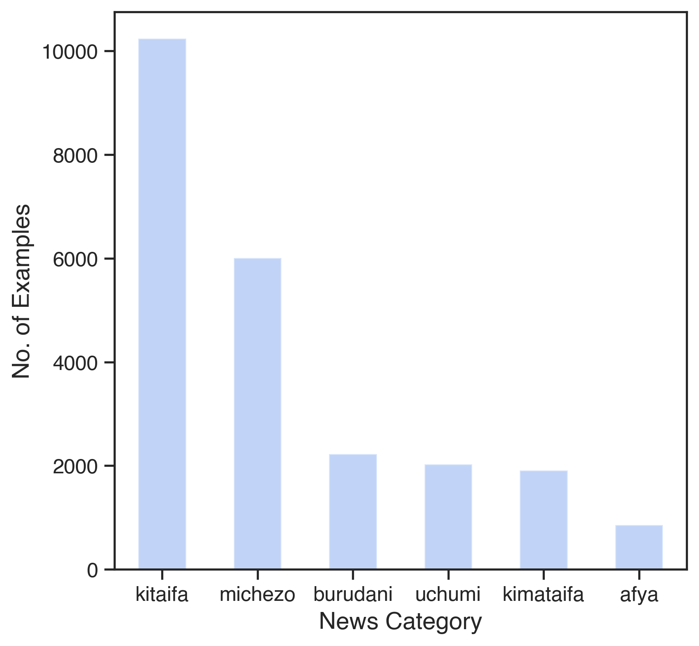
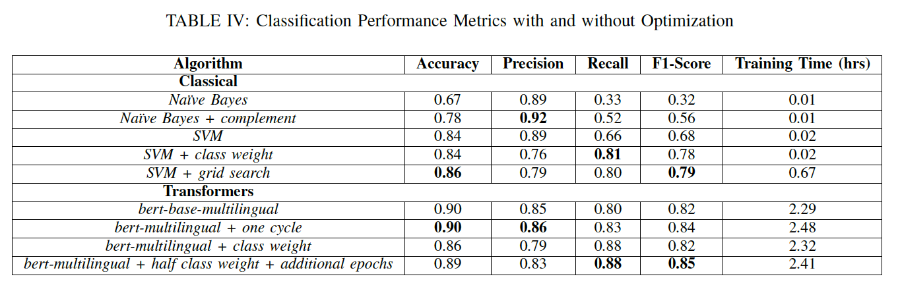

# Swahili_News_Classification

Classification of Swahili news articles using NLP techniques.

This project will investigate three different approaches to the problem of Swahili news classification. Three contrasting algorithms will be explored, namely,

- Naive Bayes
- Support Vector Machines
- Transformers - BERT model

In order to implement news classification, the dataset first requires significant preprocessing and data exploration which will be performed in the first notebook. The notebook structure is as follows:

- 1 - Data Preparation and Exploration
- 2 - Classical Approaches: Naive Bayes and SVM
- 3 - Deep Leaning Approaches: Exploring transformers

### Data

The Swahili News Classification dataset collected as part of the *AI4D African Language Dataset* challenge is utilised for the investigation. The chosen dataset consists of a compilation of Swahili news articles which are categorised according to six different news categories. Specifically the *uchumi, kitaifa, michezo, afya, kimataifa* and *burudani* categories are considered which represent finance news, local news, sports news, health news, international news and entertainment news respectively.

The dataset was obtained from [Zenodo](https://zenodo.org/record/4300294#.YMRNmDYza3I) [[1](#references)].

The distribution of the news categories present in the dataset is plotted below.

From the graph it can be observed that there is a severe class imbalance with an uneven distribution of samples across the news categories. Specifically, the *kitaifa* (local news) category has the highest number of samples with 10242 samples while the *afya* (health news) category has the lowest number of samples at 859.

### Approaches

Due to the widespread focus on English text as the subject of Natural Language Processing studies, there is a severe lack of research into NLP techniques for widely spoken African languages. Accordingly, this investigation explores the application of a variety of text classification techniques to a corpus of Swahili news articles, ranging from simple machine learning algorithms to more complex deep networks.

- The first classic, probabilistic approach is the Naive Bayes classifier.
- Support Vector Machines, another classic machine learning approach popular for text classification.
- The BERT model trained on a multilingual dataset represents a deep learning approach.

### Results

The classification results for each machine learning approach, before and after optimization are tabulated below.

From the investigation, it has been seen that the multilingual BERT network outperforms the more probabilistic Naive Bayes and Support Vector Machine approaches, with an optimized F1-score of **85%**. However, this performance is obtained at the expense of significantly more computational resources and training time in comparison to the simpler SVM approach.

#### Model Optimization

Critically, model optimization plays a pivotal role in ensuring optimal model performance across all three approaches.
Due to the imbalanced nature of the dataset, specific strategies to ensure an appropriate balance of precision and recall were required for viable classification performance across the news categories.

### Report
<a href="Swahili_News_Classification_Report_1603701.pdf">
Classifying Swahili News Articles using Probabilistic and Deep Learning Approaches

### References

[1] Davis David. Swahili: News classification dataset, Zenodo, 2020. http://doi.org/10.5281/zenodo.4300294
